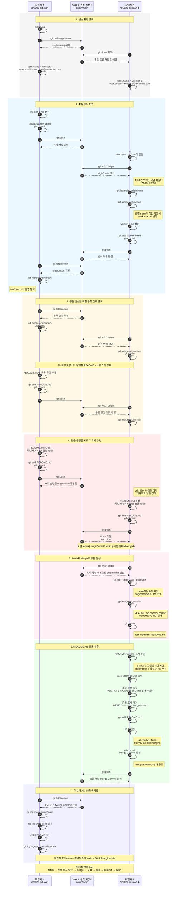

# 2026-git-start

로컬 저장소에서 수정한 내용입니다.
Github 웹에서 수정한 내용입니다. 

hello - from notebook hi - hi github
오늘의 학습 목표: 작업자 A,B의 Git 협업 및 Merge 충돌

오늘의 학습 목표: B의 Merge 충돌 실습
오늘의 학습 목표: 작업자 A의 Git 협업 실습

```mermaid
sequenceDiagram
    autonumber

    participant A as 작업자 A<br/>/c/2026-git-start
    participant R as GitHub 원격 저장소<br/>origin/main
    participant B as 작업자 B<br/>/c/2026-git-start-b

    rect rgb(245, 245, 245)
        Note over A,B: 1. 실습 환경 준비

        A->>A: git status
        A->>R: git pull origin main
        R-->>A: 최신 main 동기화

        B->>R: git clone 저장소
        R-->>B: 별도 로컬 저장소 생성

        A->>A: user.name = Worker A<br/>user.email = worker-a@example.com
        B->>B: user.name = Worker B<br/>user.email = worker-b@example.com
    end

    rect rgb(235, 248, 255)
        Note over A,B: 2. 충돌 없는 협업

        A->>A: worker-a.md 생성
        A->>A: git add worker-a.md<br/>git commit
        A->>R: git push
        R-->>A: A의 커밋 반영

        B->>B: ls<br/>worker-a.md가 아직 없음
        B->>R: git fetch origin
        R-->>B: origin/main 갱신
        Note right of B: fetch만으로는 작업 파일이<br/>변경되지 않음

        B->>B: git log main..origin/main
        B->>B: git merge origin/main
        Note right of B: 로컬 main과 작업 파일에<br/>worker-a.md 반영

        B->>B: worker-b.md 생성
        B->>B: git add worker-b.md<br/>git commit
        B->>R: git push
        R-->>B: B의 커밋 반영

        A->>R: git fetch origin
        R-->>A: origin/main 갱신
        A->>A: git merge origin/main
        Note left of A: worker-b.md 반영 완료
    end

    rect rgb(255, 248, 230)
        Note over A,B: 3. 충돌 실습을 위한 공통 상태 준비

        A->>R: git fetch origin
        R-->>A: 원격 변경 확인
        A->>A: git merge origin/main<br/>git status

        B->>R: git fetch origin
        R-->>B: 원격 변경 확인
        B->>B: git merge origin/main<br/>git status

        Note over A,B: 두 로컬 저장소가 동일한 README.md를 가진 상태

        A->>A: README.md에 공통 문장 추가
        A->>A: git add README.md<br/>git commit
        A->>R: git push

        B->>R: git fetch origin
        R-->>B: 공통 문장 커밋 전달
        B->>B: git merge origin/main
    end

    rect rgb(255, 235, 235)
        Note over A,B: 4. 같은 문장을 서로 다르게 수정

        A->>A: README.md 수정<br/>"작업자 A의 Git 협업 실습"
        A->>A: git add README.md<br/>git commit
        A->>R: git push
        R-->>A: A의 변경을 origin/main에 반영

        Note right of B: A의 최신 변경을 아직<br/>가져오지 않은 상태

        B->>B: README.md 수정<br/>"작업자 B의 Merge 충돌 실습"
        B->>B: git add README.md<br/>git commit
        B->>R: git push
        R-->>B: Push 거절<br/>fetch first

        Note over R,B: 로컬 main과 origin/main이 서로 갈라진 상태(diverged)
    end

    rect rgb(255, 240, 245)
        Note over A,B: 5. Fetch와 Merge로 충돌 발생

        B->>R: git fetch origin
        R-->>B: A의 최신 커밋으로 origin/main 갱신

        B->>B: git log --graph --all --decorate
        Note right of B: main에는 B의 커밋<br/>origin/main에는 A의 커밋

        B->>B: git merge origin/main
        Note right of B: README.md content conflict<br/>main|MERGING 상태

        B->>B: git status
        Note right of B: both modified: README.md
    end

    rect rgb(235, 255, 235)
        Note over A,B: 6. README.md 충돌 해결

        B->>B: README.md 충돌 표시 확인
        Note right of B: HEAD = 작업자 B의 변경<br/>origin/main = 작업자 A의 변경

        B->>B: 두 작업자의 내용을 검토
        B->>B: 최종 문장 작성<br/>"작업자 A·B의 Git 협업 및 Merge 충돌 해결"
        B->>B: 충돌 표시 제거<br/>HEAD / ======= / origin/main

        B->>B: git add README.md
        B->>B: git status
        Note right of B: All conflicts fixed<br/>but you are still merging

        B->>B: git commit<br/>Merge Commit 생성
        Note right of B: main|MERGING 상태 종료

        B->>R: git push
        R-->>B: 충돌 해결 Merge Commit 반영
    end

    rect rgb(240, 240, 255)
        Note over A,B: 7. 작업자 A의 최종 동기화

        A->>R: git fetch origin
        R-->>A: B가 만든 Merge Commit 전달

        A->>A: git log main..origin/main
        A->>A: git merge origin/main
        A->>A: cat README.md
        A->>A: git log --graph --all --decorate

        Note over A,B: 작업자 A의 main = 작업자 B의 main = GitHub origin/main
    end

    Note over A,B: 안전한 협업 순서<br/>fetch → 상태·로그 확인 → merge → 수정 → add → commit → push
```
